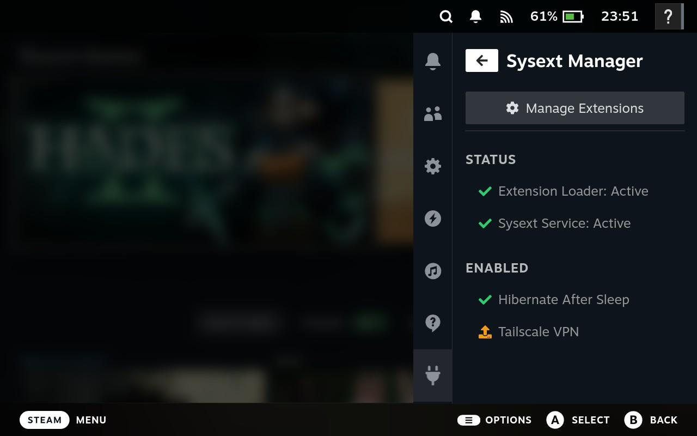
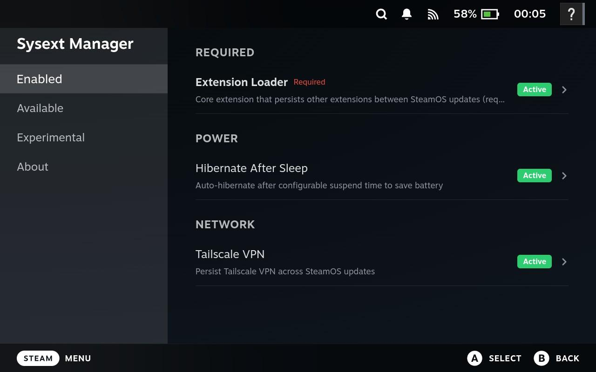
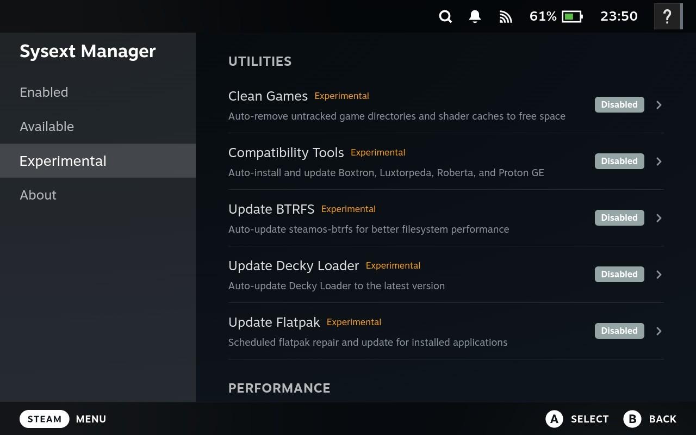
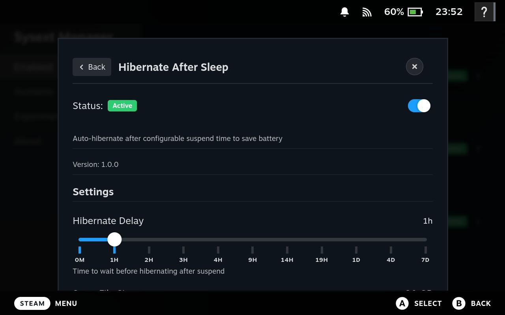
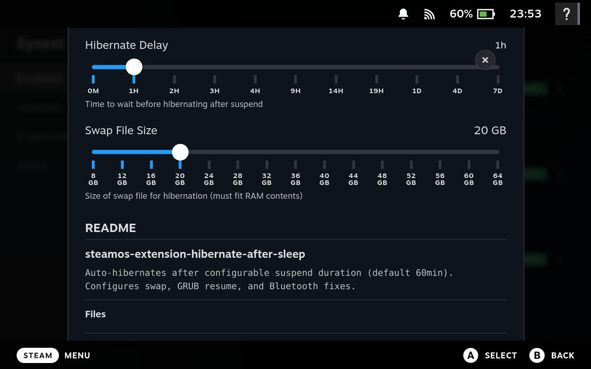
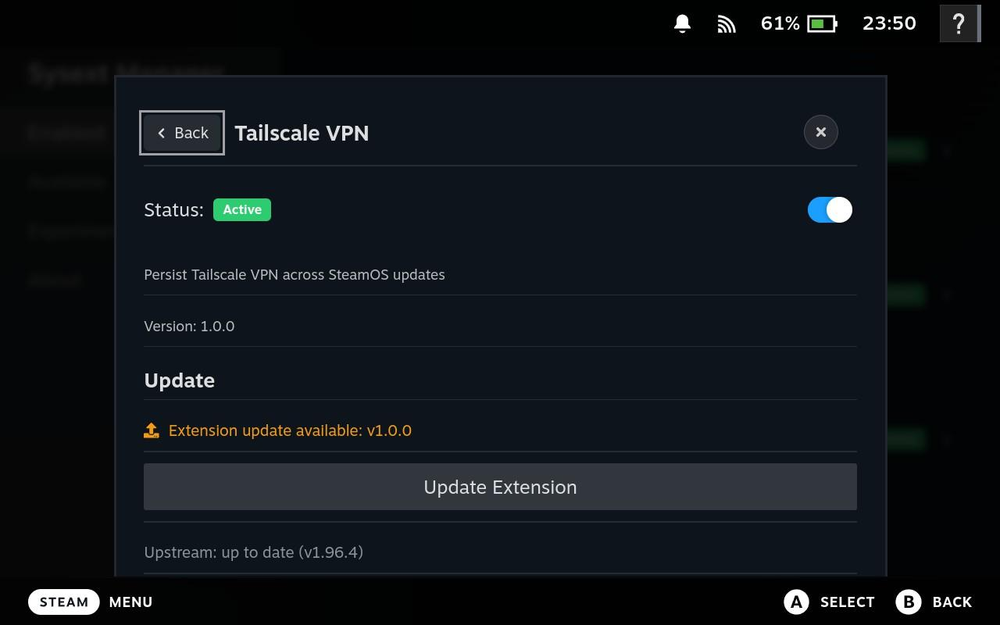

# Decky SteamOS Sysext Manager

This is a decky plugin that makes managing systemd-sysext steamOS extensions easy and seamless.

This repo is a fork of [MiningMarsh/steamos-extension-examples](https://github.com/MiningMarsh/steamos-extension-examples)

## Disclaimer

I provide no warranties for this code. Modifying your steamdeck's software could potentially make your device unbootable. Typically this is recoverable from a bootable USB drive, but proceed at your own risk.

## External Dependencies

Some extensions include or download third-party software:

| Extension | Dependency | License | Notes |
|-----------|------------|---------|-------|
| `steamos-extension-nohang` | [nohang](https://github.com/hakavlad/nohang) | MIT | Downloaded at build time |
| `steamos-extension-prelockd` | [prelockd](https://github.com/hakavlad/prelockd) | MIT | Downloaded at build time |
| `steamos-extension-tailscale` | [Tailscale](https://tailscale.com) | BSD-3-Clause | Downloaded at runtime |
| `steamos-extension-irqbalance` | [irqbalance](https://github.com/Irqbalance/irqbalance) | GPL-2.0 | Statically compiled binary |
| `steamos-extension-preload` | [preload](https://sourceforge.net/projects/preload/) | GPL-2.0 | Statically compiled binary |

## Screenshots

### Quick Access Menu

### Enabled Plugins

### Experimental Extensions

### Hibernate After Sleep Configuration

### Tailscale Configuration

